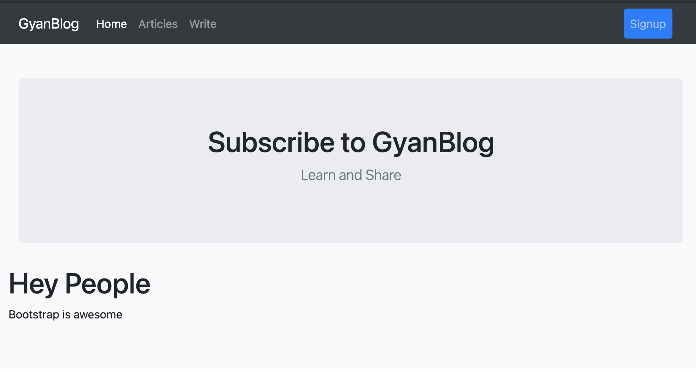
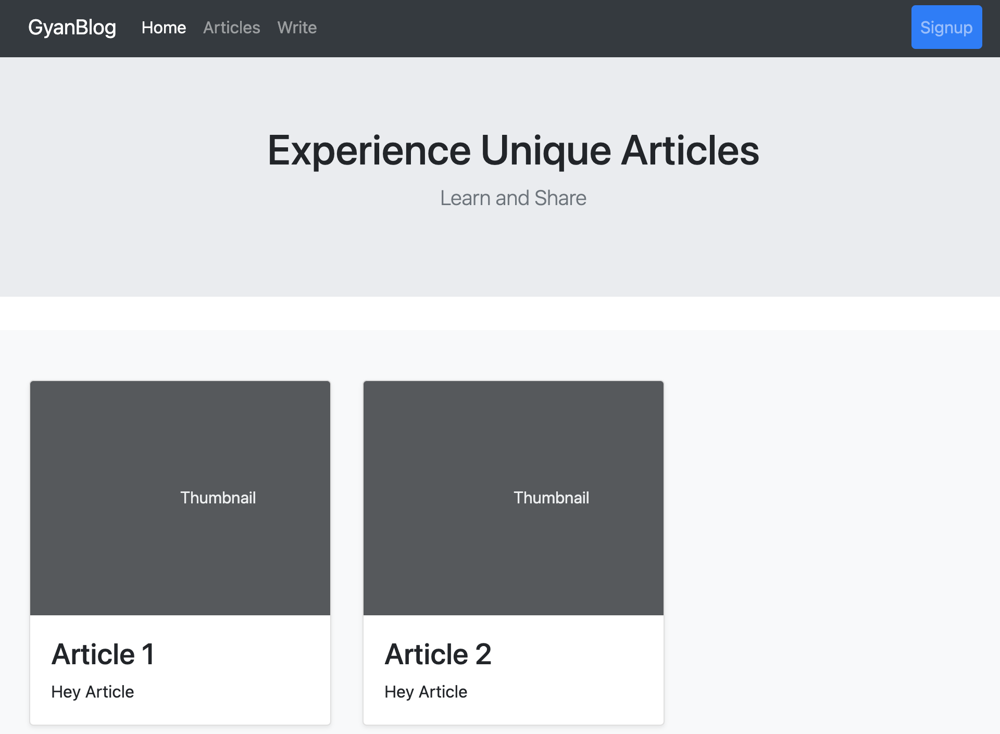
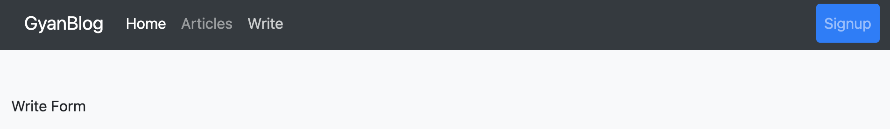

# Bootstrap template for Next.js

## Run

```
npm run dev
```

Open http://localhost:3000/

## Code Structure Understanding
https://www.gyablog.com/javascript/next-js-bootstrap-template-navbar-header/

## Screenshots
### Screenshots Home Page (/)



### Screenshots Articles Page (/articles)



### Screenshots Write Page (/write)



